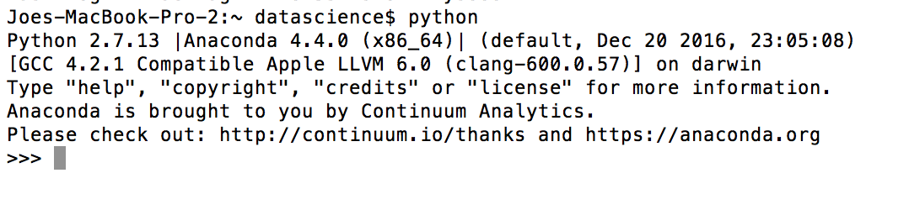
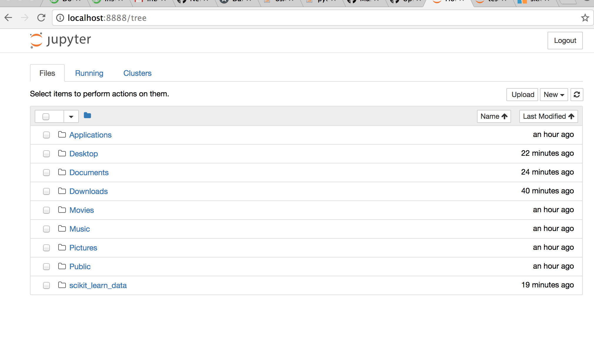
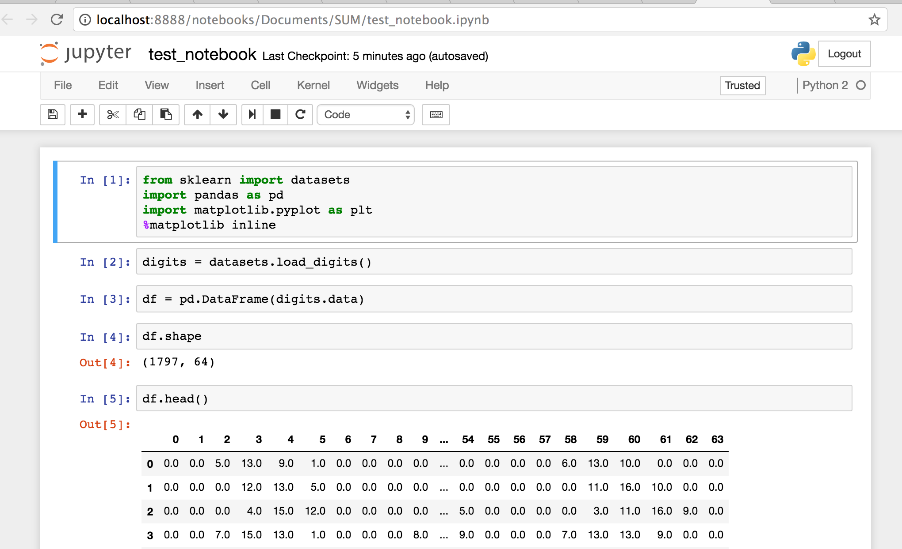

# Setting Up Python

## On a Mac
### Install the Anaconda Distribution of python
1. [Download the Anaconda Distribution of python](https://www.continuum.io/downloads#macos). Follow the prompts to install it. This distribution comes with all of the packages you will need for the Data Science tutorials.
2. Open a Terminal window. (This is an application in the Utilities subfolder of your Applications folder.) If you already had a Terminal window open, restart Terminal.
3. Type `python` at the prompt and press enter. You should see: 
        

### Test your install
1. Clone or download the `sum_data_science` repo: Go back to [https://github.com/alligilmore-sum/sum_data_science/](https://github.com/alligilmore-sum/sum_data_science/). Click the green 'Clone or Download' button. If you are not familiar with GitHub, choose 'Download ZIP'. Unzip the file.
2. In a new Terminal window, type `jupyter notebook`. You should see: 
        
3. Navigate to the location where you downloaded `sum_data_science`. Open the file `test_notebook.ipynb`. You should see: 
        
4. Go to the 'Cell' menu and choose 'Run All'.

## On Windows
### Install the Anaconda Distribution of python. 
[Follow these instructions](https://docs.continuum.io/anaconda/install/windows.html) to install the Anaconda distribution of python. This distribution comes with all of the packages you will need for the Data Science tutorials.

### Test your install
1. Clone or download the `sum_data_science` repo: Go back to [https://github.com/alligilmore-sum/sum_data_science/](https://github.com/alligilmore-sum/sum_data_science/). Click the green 'Clone or Download' button. If you are not familiar with GitHub, choose 'Download ZIP'. Unzip the file.
2. Start jupyter notebook from the icon in the Windows Start Menu. [See documentation for details.](http://jupyter-notebook-beginner-guide.readthedocs.io/en/latest/execute.html)
3. Navigate to the location where you downloaded `sum_data_science`. Open the file `test_notebook.ipynb`. You should see: 
        
4. Go to the 'Cell' menu and choose 'Run All'.
